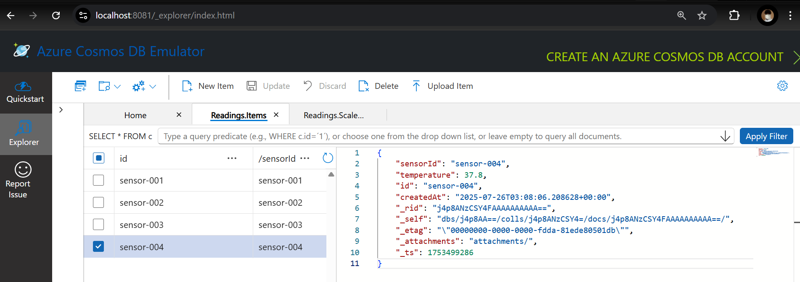

# 📡 Sensor Data Updater (Azure Function App with Cosmos DB Emulator)

This is a simple Azure Function app written in Python that receives sensor readings via HTTP POST and stores or updates them in Azure Cosmos DB. This project is configured to run **locally** using the **Azure Cosmos DB Emulator** and Python 3.12.

---

## 📋 Prerequisites

Before you begin, ensure you have the following installed:

- **Python 3.12**  
  [Download Python 3.12.10](https://www.python.org/downloads/release/python-31210/)

- **Azure Cosmos DB Emulator for Windows**  
  [Install Emulator → Microsoft Docs](https://learn.microsoft.com/en-us/azure/cosmos-db/how-to-develop-emulator?tabs=windows%2Cpython&pivots=api-nosql#install-the-emulator)

- **Azure Functions Core Tools**
  ```bash
  npm install -g azure-functions-core-tools@4 --unsafe-perm true
  ```

### Clone the repository or download the zip

```bash
git clone https://github.com/Lanzar-dev/sensor_data_updater.git
```

### Change into the project directory in a terminal

```bash
cd <your-unzipped-folder>
```

### Add local.settings.json file in the root directory with the following content

```bash
{
  "IsEncrypted": false,
  "Values": {
    "AzureWebJobsStorage": "UseDevelopmentStorage=true",
    "FUNCTIONS_WORKER_RUNTIME": "python",
    "COSMOS_URL": "https://localhost:8081/",
    "COSMOS_KEY": "<COSMOS_DB_EMULATOR_KEY>",
    "COSMOS_DB_NAME": "SensorDB",
    "COSMOS_CONTAINER_NAME": "Readings"
  }
}
```

### Create and activate a virtual environment

```bash
python -m venv .venv
.venv\Scripts\activate
```

### Install dependencies

```bash
pip install -r requirements.txt
```

### Start the Azure Cosmos DB Emulator

`Make sure the emulator is already running before running the function app.
Only one instance of the emulator should be running.`

```powershell
& "C:\Program Files\Azure Cosmos DB Emulator\Microsoft.Azure.Cosmos.Emulator.exe" /Port=65000
```

### Run the Azure Function locally

```bash
func start
```

`If successful, the app will be available at:`

```bash
http://localhost:7071/api/update-sensors
```

### From a separate terminal, run the following command:

```bash
curl -X POST http://localhost:7071/api/update-sensors ^
  -H "Content-Type: application/json" ^
  -d "[
        {
          \"sensorId\": \"sensor-001\",
          \"temperature\": 25.6,
          \"humidity\": 60
        },
        {
          \"sensorId\": \"sensor-002\",
          \"temperature\": 22.8
        }
      ]"
```

### Cosmos DB result


